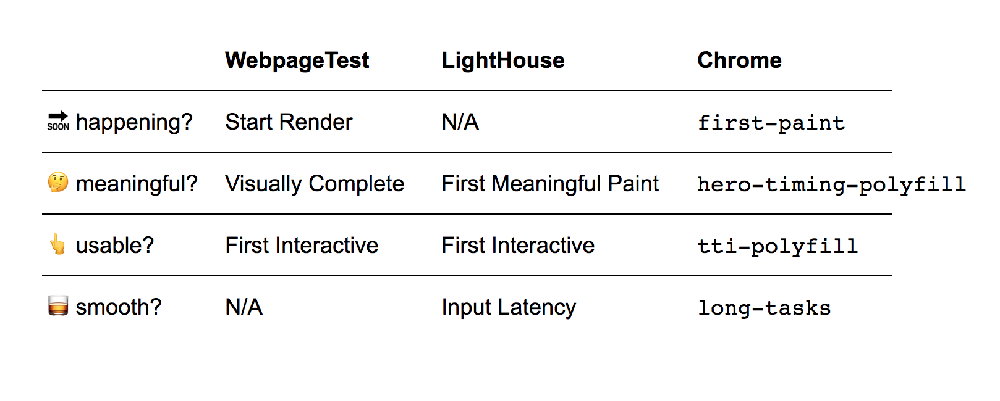

# Web Perf like it's 2017

Everything is changing so fast: new devices, JS framework of the day, the expectations of our users. How do we respond?

What's the current state of the art in web performance analytics? What's worth measuring and how? What are some common pain points?

Let's find out!

# slides

Slides built with reveal.js, hosted via Github Pages:

https://csabapalfi.github.io/web-perf-like-its-2017/

# video

The talk is [available on YouTube](https://www.youtube.com/watch?v=7ufRZ8ABagw).


# references

## ⚡ = 💰 performance is money

[Akamai Online Retail Performance Report: Milliseconds Are Critical](https://www.akamai.com/uk/en/about/news/press/2017-press/akamai-releases-spring-2017-state-of-online-retail-performance-report.jsp)

[The State of Online Retail Performance | Spring 2017 Akamai - Soasta - PDF](https://www.soasta.com/wp-content/uploads/2017/04/State-of-Online-Retail-Performance-Spring-2017.pdf)

## 🤓 about me

[@csabapalfi](https://twitter.com/csabapalfi) on twitter

used to work with [YLD](https://www.yld.io/) who organized the meetup

my current main client: [HomeAway.com](https://www.homeaway.com/)

## 🏁 'classic' metrics

[`DOMContentLoaded`](https://developer.mozilla.org/en-US/docs/Web/Events/DOMContentLoaded)

[`load`](https://developer.mozilla.org/en-US/docs/Web/Events/load) or more specifically `window.load`

## 👫 user-centric metrics

the idea from [Leveraging the Performance Metrics that Most Affect User Experience](https://developers.google.com/web/updates/2017/06/user-centric-performance-metrics) by @philipwalton / Google

🔜 is it happening? 🤔 is it meaningful? 👆 is it usable? 🥃 is it smooth?

## ⏱️ metrics from

[WebpageTest.org](https://www.webpagetest.org/) 
(also [WPO-Foundation/webpagetest](https://github.com/WPO-Foundation/webpagetest) on GitHub)

[Lighthouse](https://developers.google.com/web/tools/lighthouse/)
(also [GoogleChrome/lighthouse](https://github.com/GoogleChrome/lighthouse) on GitHub)

[`PerformanceObserver`](https://developer.mozilla.org/en-US/docs/Web/API/PerformanceObserver) in the browser

## 🔜 first pixel on the screen?

[Definition - Start Render - webpagetest](https://sites.google.com/a/webpagetest.org/docs/using-webpagetest/metrics)

[Spec - Paint Timing](https://w3c.github.io/paint-timing/)

## 🤔 above the fold rendered?

[Definition - Visually Complete - webpagetest](https://sites.google.com/a/webpagetest.org/docs/using-webpagetest/metrics/speed-index) - this is on the Speed Index page of the docs

[Definition - First Meaningful Paint](https://developers.google.com/web/tools/lighthouse/audits/first-meaningful-paint)

[Spec - First Meaningful Paint](https://docs.google.com/document/d/1BR94tJdZLsin5poeet0XoTW60M0SjvOJQttKT-JK8HI/view)


## 🤔 speed index

Speed Index a metric not mentioned in the talk but related to measuring rendering progress.

[Definition - Perceptual Speed Index - Lighthouse](https://developers.google.com/web/tools/lighthouse/audits/speed-index)

[Definition - Speed Index - webpagetest](https://sites.google.com/a/webpagetest.org/docs/using-webpagetest/metrics/speed-index)

[Speed Perception and Lighthouse](https://ldnwebperf.org/events/speed-perception-and-lighthouse/) by @estelle - LdnWebPerf talk about Speed index

## 🤔 hero element timing

[W3C github issue - Element Timing API](https://github.com/w3c/charter-webperf/issues/30)

[Spec - Hero Element Timing](https://docs.google.com/document/d/1yRYfYR1DnHtgwC4HRR04ipVVhT1h5gkI6yPmKCgJkyQ/edit#)

[Blogpost - Hero Element Timing - SpeedCurve](https://speedcurve.com/blog/web-performance-monitoring-hero-times/)

[Polyfill - Hero Element Timing](https://github.com/tdresser/hero-element-polyfill) - see also the [announcement here](https://groups.google.com/a/chromium.org/forum/m/#!topic/progressive-web-metrics/ND6JVZRWqqg)

## 👆 JS loaded to make elements interactive?

[Spec - User Timing](https://www.w3.org/TR/user-timing/)

```js
        componentDidMount() {
            performance.mark("yourcomponent.usable");
        }
``` 

## 👆 first interactive (time to interactive)

[Definition - Time to Interactie - webpagetest](https://github.com/WPO-Foundation/webpagetest/blob/master/docs/Metrics/TimeToInteractive.md)

[Definition - First Interactive - Lighthouse](https://developers.google.com/web/tools/lighthouse/audits/first-interactive)

[Spec - First Interactive - Lighthouse](https://docs.google.com/document/d/1GGiI9-7KeY3TPqS3YT271upUVimo-XiL5mwWorDUD4c/edit)

[Spec - Long Tasks](https://w3c.github.io/longtasks/)

[Polyfill - First Interactive](https://github.com/GoogleChromeLabs/tti-polyfill)

## 🥃 input latency

[Definition - Estimated Input Latency - Lighthouse](https://developers.google.com/web/tools/lighthouse/audits/estimated-input-latency)

## all together now



## 👥 real user monitoring

[Example - tracking `first-paint` with Google Analytics](https://developers.google.com/web/updates/2017/06/user-centric-performance-metrics#tracking_fpfcp) - watch out! this is Chrome 60+ only

## 😵 load abandonment

[Example - tracking `visibilitychange`](https://developers.google.com/web/updates/2017/06/user-centric-performance-metrics#load_abandonment)

[Spec - Page Visibility](https://www.w3.org/TR/page-visibility-2/)

# summary

think about performance in terms UX

leverage user-centric metrics

use synthethic testing to prevent regressions

verify your performance with real user monitoring


