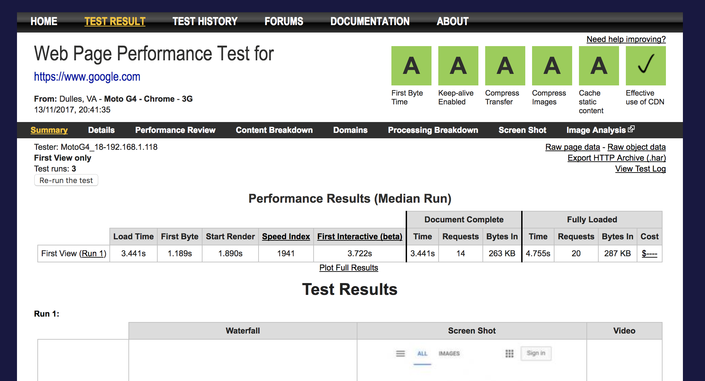
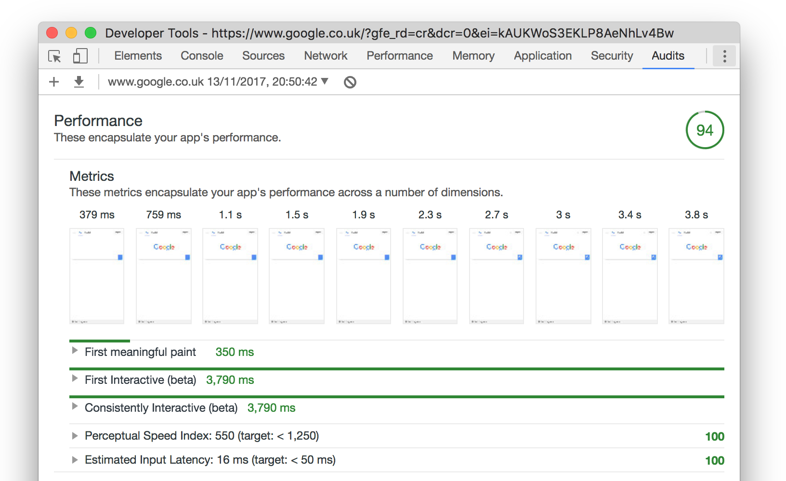
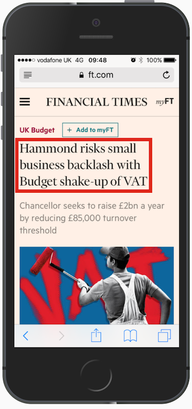
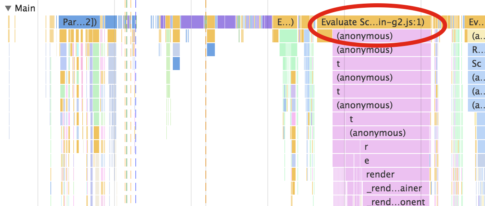
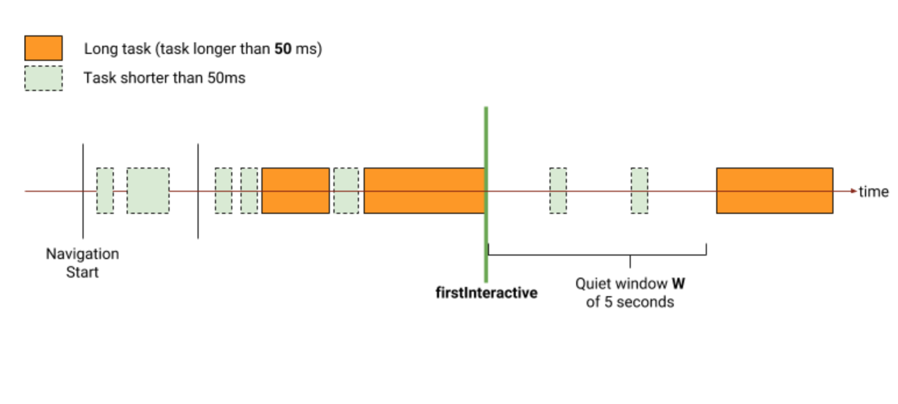

# Web Perf like it's 2017

# ⚡ = 💰  <!-- .element: class="fragment" -->

fast or driving customers away <!-- .element: class="fragment" -->

Note:

* web performance is money

* fast pages convert users to customers

* either fast or it'll drive customers away

---

# 🤓 Csaba Palfi

[@csabapalfi](https://twitter.com/csabapalfi)

doing web for ~10 years

ex-(Hotels.com • Yahoo! • FT.com • trainline + YLD...)

now: HomeAway.com <!-- .element: class="fragment" -->

Note:

* doing web for about 10 years, lots of different sites

* now: consultant at HomeAway 

* helping out with landing pages, we care about performance

---

# 🙋 
How many people here are NOT web developers?

(or full-stack)

Note:

* any non-web developers? 

* sorry, will try to make it interesting

* tell your web-dev friends

---

Today we're going to talk about...

## ~~🤹 tips and tricks~~

## ⏱️ measurements

Note:

* you can't improve what you can't measure

* chosing good measurements lets you optimize what matters

---

...more specifically

## 😍 user-centric metrics <!-- .element: class="fragment" -->

## 👥 real user-monitoring <!-- .element: class="fragment" -->

Note:

* these trends becoming more mainstream

* leveraging performance metrics that affect user experience the most

* measuring performance on real users, in production

---

# 🏁 What is 'fast'?

`DOMContentLoaded`? `load`? 

nothing to do with UX <!-- .element: class="fragment" data-fragment-index="1" -->

Note:

* is there a single event when the page is considered loaded?

* DOM built - too early, all resources loaded, too late

* let's try something else

---

# 👫 How users think?

Note:

* What if we put our user hat on...

* and tried to think about performance...

* in terms of questions the user might ask...

* troughout the experience?

---

<!-- .slide: data-background="img/happening_ha.png" data-background-size="contain" -->

Note:

* First thing: was the navigation successful? 

* *is it happening?*

* Is the page loading?

* Is the server even responding?

---

<!-- .slide: data-background="img/meaningful_ha.png" data-background-size="contain" -->

Note:

* Next: has enough content rendered that I can make sense of the page? 

* *is it meaningful?*

* Do I see what I came here for?

* Am I even on the right page?

---

<!-- .slide: data-background-video="video/usable_ha.mp4" data-background-size="contain" data-background-video-loop="true" -->

Note:

* Then finally: can I interact with it? 

* *is it usable?* (esp. travel site/search)

* Also: are these interaction free of lag or jank?

* *is it smooth?*

---

# 👫 How users think?

🔜 happening?

🤔 meaningful?

👆 usable?

🥃 smooth?

Note:

* captures how the users are looking for:

* visual feedback and reassurance

* that everything's going OK.

---

# ⏱️ Metrics from?

<!-- .slide: data-background-color="#232323" -->

Note:

* Where do we get metrics from?

* Before we associate individual metrics.

* Let's look at some tools first.

---

# webpagetest.org



<!-- .slide: data-background-color="#181840" -->

Note:

* website to run a free performance tests

* in a real browser from various locations

* open-source, can run your own instances

---

# Lighthouse



Note:

* perfomance audit tool from Google

* right in Chrome DevTools under the Audits tab

* since Chrome 60

---


```js
const observer = new PerformanceObserver((list) => {
        // ... list.getEntries()
});

observer.observe({entryTypes: ['resource']});
```

<!-- .slide: data-background-color="#232323" -->

Note:

* be notified of new performance entries...

* as they are recorded in the browser's performance timeline

* we'll look at some new entryTypes later

* not in mobile Safari or Edge

---

# 👫 How users think?

🔜 happening?

🤔 meaningful?

👆 usable?

🥃 smooth?

Note:

* back to our handy questions...

---

# <span style="filter: invert(100%);">🔜</span> happening?

first pixel on the screen? 

Start Render - webpagetest.org <!-- .element: class="fragment" data-fragment-index="1" -->

N/A explicitly - LightHouse <!-- .element: class="fragment" data-fragment-index="1" -->

<!-- .slide: data-background-color="#232323" -->

Note:

* affected by slow time-to-first-byte, render-blocking assets

* but this metric captures: visual feedback

* do browsers have this?

---


https://w3c.github.io/paint-timing/

`entryTypes: ['paint']` <!-- .element: class="fragment" -->

<div>`first-paint`</div> <!-- .element: class="fragment" -->

Note:

* coming to the browser - chrome 60+

* remember PerformanceObserver?

---

# 🤔 meaningful?

above the fold rendered?

Visually Complete - webpagetest.org <!-- .element: class="fragment" -->

Time to First Meaningful Paint - LightHouse <!-- .element: class="fragment" -->

<!-- .slide: data-background-color="#232323" -->

Note:

* focusing on above the fold (ATF) content

* VC - 90% pixels ATF no longer changing

* FMP - paint that follows biggest ATF layout change + webfonts

---

## hero elements

Neither in webpagetest.org or LightHouse <!-- .element: class="fragment" -->

 

Note:

* VC + FMP gives all elements the same importance

* some elements matter more

* that could be different on each site

---

## `tdresser/`
## `hero-element-polyfill`

<!-- .slide: data-background-color="#232323" -->

Note:

* using `MutationObserver` and `IntersectionObserver`

* popped up chromium forum, around a month ago

* really new, haven't tried

---


<!-- .slide: data-background-color="#232323" -->

Note:

* SpeedCurve is a paid for product built around WPT

* introduced neat hero element timing support

* used by us

---

# 👆 usable?

loaded JS to make things work?

https://www.w3.org/TR/user-timing/ <!-- .element: class="fragment" data-fragment-index="1" -->

```js
        componentDidMount() {
            performance.mark("datepicker.active");
        }
``` 
<!-- .element: class="fragment" data-fragment-index="1" -->

<!-- .slide: data-background-color="#232323" -->

Note:

* most interaction will require JS

* has that been loaded?

* can use the User Timing API to mark this 

---

# 👆 usable?

are long tasks blocking the main thread?



<!-- .slide: data-background-color="#232323" -->

Note:

* the browser responds to user input by adding tasks to a task queue

* the main thread will then execute them one by one

* your apps JS will execute on the main thread

* this can block the main thread like our react app booting there

---

## First Interactive

both in webpagetest.org and Lighthouse <!-- .element: class="fragment" -->



<!-- .slide: data-background-color="#232323" -->

Note:

* how quickly the main thread gets quiet?

* quiet enough to handle user input

* sometimes called TTI

* another metric: consistently interactive

---


https://w3c.github.io/longtasks/

`entryTypes: ['longtask']` <!-- .element: class="fragment" -->

long task: an event loop task that exceeds 50ms <!-- .element: class="fragment" -->

Note:

* long tasks are available in the browser: Chrome 58+

* good old PerformanceObserver

* does attribution, too

---

## `GoogleChromeLabs/`
## `tti-polyfill`

<!-- .slide: data-background-color="#232323" -->

Note:

* Now we can also implement tti!

* haven't tried, yet

* Chrome 58+

---

# 🥃 smooth?

`eventListener`s execute quickly?

Estimated Input Latency - LightHouse <!-- .element: class="fragment" data-fragment-index="1" -->

N/A - webpagetest.org <!-- .element: class="fragment" data-fragment-index="1" -->

`performance.now() - event.timeStamp;` <!-- .element: class="fragment" -->

<!-- .slide: data-background-color="#232323" -->

Note:

* from when the event was created until eventListener called

* not in WPT

* can do a bit of a DIY solution, too :D
---

# 🥃 smooth?

watch out for track long tasks

<!-- .slide: data-background-color="#232323" -->

Note:

* we can also just track long tasks

* #1 cause of jank or lag

* typical offenders are thirdparty scripts, marketing tags

---

<!-- .slide: data-background="img/re-cap.png" data-background-size="contain" -->

Note:

* quick recap

* yay, in most environments we can answer these questions!

* brower is actually just Chrome :(

---

# 🔬 Let's test!

<span class="fragment">`first-paint`: 0.5s</span> <span class="fragment">/ ...</span>

 <!-- .element: class="fragment" -->

Note:

* happy days, let's run tests...

* get a single number for each

* in reality it's a collection of all times from all users

* more accurately represented by a histogram

---

# synthetic 
# vs 
# real-user monitoring

Note:

* synthetic: I'm making a request

* report metrics about real users in production

* sometimes called RUM

---

# 👋 RUM in your browser

Note:

* got to be reliable, not messing up performance

* synthetic has all the time to analyze traces/screenshots, etc

---

# 😵 survirvorship bias

<span class="fragment">track `visibilitychange`<span>

Note:

* use `visibilitychange` to track load abandonment

* good browser support

* small amount of blocking JS in `<head>`

---

<!-- .slide: data-background="img/mobile-throw.gif" -->

Note:

* sometimes even that might not work

* did `visibilitychange` fire there?

* now let's talk about what makes me feel like that?

---

# 😱 browser support

Web Perf like it's 2020 <!-- .element: class="fragment" -->

Note:

* if my talk was just about RUM

* it might as well be 2025


---

# 🍻 Synthetic & RUM

Note:

* they complement each other

* run synthetic test in your pipeline to prevent regression

* verify on production with RUM (and maybe synthetic, too) 

---

# Summary

think about performance in terms UX <!-- .element: class="fragment" -->

leverage user-centric metrics <!-- .element: class="fragment" -->

use synthethic testing to prevent regressions <!-- .element: class="fragment" -->

verify your performance with real user monitoring <!-- .element: class="fragment" -->

---

# Thanks! 

# Questions?

@csabapalfi