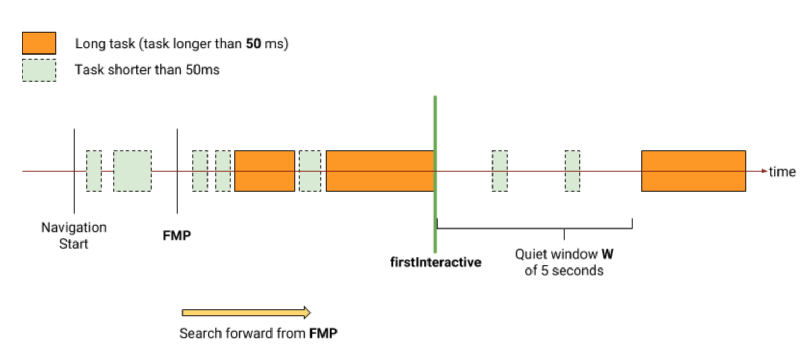

# Web Perf like it's 2017

Note:

* let's talk about web performance

---

# 🤓 Csaba Palfi

[@csabapalfi](https://twitter.com/csabapalfi)

doing web for ~10 years <!-- .element: class="fragment" data-fragment-index="1" -->

ex-(Hotels.com • Yahoo! • FT.com • trainline + YLD...) <!-- .element: class="fragment" data-fragment-index="1" -->

now: HomeAway.com <!-- .element: class="fragment" -->

Note:

* doing web for about 10 years, lots of different sites

* now: consultant at HomeAway 

* helping out with landing pages, we care about performance

---

# 🙋 
How many people here are NOT web developers?

(or full-stack)

Note:

* any non-web developers? 

* sorry, will try to make it interesting

* tell your web-dev friends

---

Today we're going to talk about...

## ~~🤹 tips and tricks~~

## 📏 measurements

Note:

* you can't improve what you can't measure

* chosing good measurements let you optimize optimize what matters

---

...more specifically

## 😍 user-centric metrics <!-- .element: class="fragment" -->

## 👥 real user-monitoring <!-- .element: class="fragment" -->

Note:

* some trends becoming more mainstream

* leveraging performance metrics that affect user experience the most

* measuring performance on real users, in production

---

# 🏁 What is 'fast'?

`DOMContentLoaded`? `load`? 

need more metrics!! <!-- .element: class="fragment" -->

Note:

* is there a single event when the page is considered loaded?

* the browser gives us `DOMContentLoaded` and `load`

* DOM built - too early, all resources loaded, too late

---

# 📏 Metrics from?

<!-- .slide: data-background-color="#232323" -->

Note:

* Let's look at some tools.

---

# webpagetest.org


<!-- .slide: data-background-color="#181840" -->

Note:

* it's a website to run a free performance test 

* in a real browser at various locations around the world

* Open-source, too. You can even run your own instances

---

# Lighthouse


Note:

* perfomance audit tool from Google

* right in Chrome devtools under the audits tab

* since Chrome 60

---


```js
const observer = new PerformanceObserver((list) => {
        // ... list.getEntries()
});

observer.observe({entryTypes: ['resource']});
```

Note:

* be notified of new performance entries...

* as they are recorded in the browser's performance timeline

* we'll look at some new entryTypes later

* not in mobile Safari, under consideration for Edge

---

# 📏 ETOOMANYMETRICS

<!-- .slide: data-background-color="#232323" -->

Note:

* How do we pick what to look at?

---

# 👫 What do users think?

Note:

* What if we put our user hat on...

* and tried to think about performance...

* in terms of questions the user might ask...

* troughout the experience?

---

<!-- .slide: data-background="img/happening_ha.png" data-background-size="contain" -->

Note:

* First thing: was the navigation successful? 

* *is it happening?*

* Is the page loading?

* Is the server even responding?

---

<!-- .slide: data-background="img/meaningful_ha.png" data-background-size="contain" -->

Note:

* Next: has enough content rendered that I can make sense of the page? 

* *is it meaningful?*

* Do I see what I came here for?

* Am I even on the right page?

---

<!-- .slide: data-background-video="video/usable_ha.mp4" data-background-size="contain" data-background-video-loop="true" -->

Note:

* Then finally: can I interact with it? 

* *is it usable?*

* Also: are these interaction free of lag or jank?

* *is it smooth?*

---

# 👫 How users think?

🔜 happening?

🤔 meaningful?

👆 usable?

🥃 smooth?

Note:

* These questions capture how the users are looking for:

* visual feedback and reassurance

* that everything's going OK.

Let's look at metrics?

---

# <span style="filter: invert(100%);">🔜</span> happening?

* first pixel on the screen?
* Start render - WebPageTest

<!-- .slide: data-background-color="#232323" -->

---


https://w3c.github.io/paint-timing/

`first-paint` / `first-contentful-paint`

---

# 🤔 meaningful?

* Visually Complete - WebpageTest.org
* Time to First Meaningful Paint - LightHouse
* Speed Index - both

<!-- .slide: data-background-color="#232323" -->

Note:

https://ldnwebperf.org/events/speed-perception-and-lighthouse/

---

# Hero Element Timing


<!-- .slide: data-background-color="#232323" -->

Note:

https://github.com/w3c/charter-webperf/issues/30

[Spec Google Docs](https://docs.google.com/document/d/1yRYfYR1DnHtgwC4HRR04ipVVhT1h5gkI6yPmKCgJkyQ/edit#)

[SpeedCurve blogpost](https://speedcurve.com/blog/web-performance-monitoring-hero-times/)

---

## `tdresser/`
## `hero-element-polyfill`

2 weeks ago

<!-- .slide: data-background-color="#232323" -->

Note:

* using MutationObserver 
* and IntersectionObserver
* [Github](https://github.com/tdresser/hero-element-polyfill)
* [Google Groups Announcement](https://groups.google.com/a/chromium.org/forum/m/#!topic/progressive-web-metrics/ND6JVZRWqqg)
* DIY [old SpeedCurve blogpost](https://speedcurve.com/blog/user-timing-and-custom-metrics/)

---

# 👆 usable?

* User Timing `mark`s

<!-- .slide: data-background-color="#232323" -->

---

long task: an event loop task that exceeds 50ms

 <!-- .element: class="fragment" data-fragment-index="1" -->

https://w3c.github.io/longtasks/ <!-- .element: class="fragment" data-fragment-index="1" -->

--- 

# Time to Interactive



<!-- .slide: data-background-color="#232323" -->

Note:

https://docs.google.com/document/d/1GGiI9-7KeY3TPqS3YT271upUVimo-XiL5mwWorDUD4c/preview#
https://github.com/GoogleChromeLabs/tti-polyfill

---

# 🥃 smooth?

* Estimated Input Latency (LightHouse)

* DIY in `eventListener`
```js
const lag =
    performance.now() - 
    event.timeStamp;
```

* absence of long tasks

<!-- .slide: data-background-color="#232323" -->

---

# 👫 User-centric metrics

TODO: table or something

🔜 happening? Start render, FP, FCP

🤔 meaningful? Visually complete, FMP, hero elements

👆 usable? custom marks, TTI

🥃 smooth? input latency, long-tasks

---

# How to test?

TODO - better title

Start Render: 1s <span class="fragment">/ Visually complete: 2s</span> <span class="fragment">/ ...</span>

 <!-- .element: class="fragment" -->

---

# RUM challenges

* implementation in production code
* telemetry loss bias
* browser support for metrics

---

# Web perf like it's 2025

---

# Load abandonment

* track `visibilitychange`
* small amount of blocking JS in `<head>`

---

# Synthetic

* do it before production! (too)

---

# Summary

TODO better text

* measure user centric metrics
* use synthethic measurements in your pipeline
* validate/track real users in production

---

# Thanks, questions?