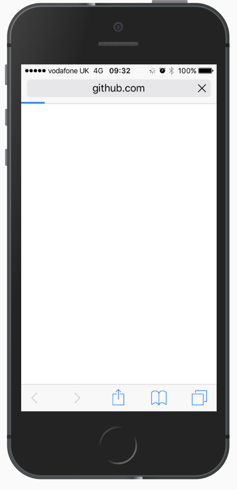
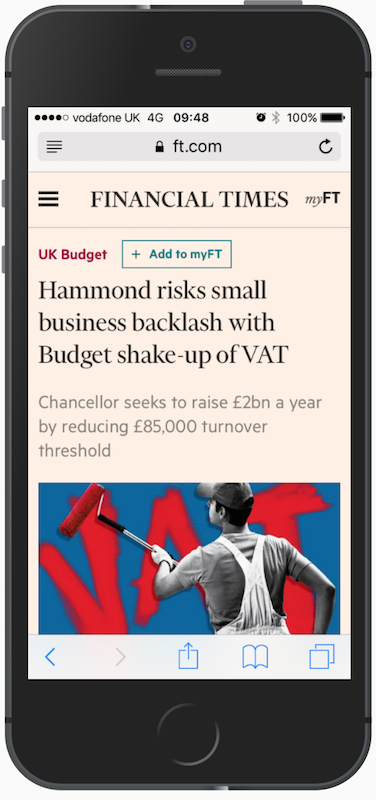
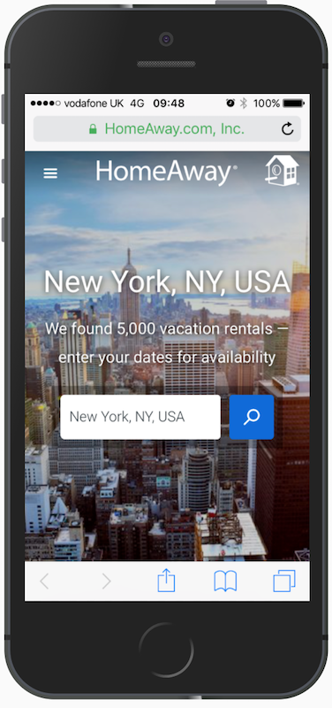

# Web Perf like it's 2017

Note:

---

# 🤓 Csaba Palfi

[@csabapalfi](https://twitter.com/csabapalfi)

doing web for ~10 years

ex-(Hotels.com • Yahoo! • FT.com • TES • trainline + YLD)

now: HomeAway.com

Note:

doing web for around 10 years now at lots of different sites

thanks to YLD for organizing the meetup

consultant at HomeAway helping out with landing pages

we care about performance

---

# 🙋 
How many people here are NOT web developers?

(or full-stack)

Note:

Any non-web developers

---

Today we're going to talk about...

## ~~🤹 tips and tricks~~

## 📏 measurements

---

...more specifically

## 😍 user-centric metrics <!-- .element: class="fragment" -->

## 👥 real user-monitoring <!-- .element: class="fragment" -->

---

# 🏁 What is 'fast'?

`DOMContentLoaded`? `load`? 

a single metric won't do <!-- .element: class="fragment" -->

user experience? <!-- .element: class="fragment" -->

---

# 👫 How users think?

---



---

<div class="split">





</div>

---

<!-- .slide: data-background-video="video/usable_ha.mp4" data-background-size="contain" data-background-video-loop="true"-->

---

# 👫 How users think?

🔜 happening?

🤔 meaningful?

👆 usable?

🥃 smooth?

---

# 🛠️ Metrics from?

  <!-- .element: class="fragment" -->   <!-- .element: class="fragment" -->

  <!-- .element: class="fragment" -->


---

# 🔜 happening?

* first pixel on the screen?
* Start render - WebPageTest.org

---


`first-paint` / `first-contentful-paint`

---

# 🤔 meaningful?

* Visually Complete - WebpageTest.org
* Time to First Meaningful Paint - LightHouse

---
# 🤔 meaningful?

* Hero Element Timing

Note:

elementtiming
https://speedcurve.com/blog/user-timing-and-custom-metrics/
https://speedcurve.com/blog/web-performance-monitoring-hero-times/

---

# 👆 usable?

* User Timing `mark`s
* Time to Interactive

---

# 🥃 smooth?

* Estimated Input Latency (LightHouse)

* DIY in `eventListener`
```js
const lag =
    performance.now() - 
    event.timeStamp;
```

---


https://w3c.github.io/longtasks/

---

# 👫 User-centric metrics

🔜 happening? Start render, FP, FCP

🤔 meaningful? Visually complete, FMP, hero elements

👆 usable? custom marks, TTI

🥃 smooth? input latency, long-tasks

---

# How do you measure?

* synthetic
* real user monitoring

---

# Ok, why RUM?

* not all users have the same experience

---

# RUM challenges

* measurement browser support
* implementation lives in production code
* telemetry loss bias

---

# Load abandonment

* track `visibilitychange`
* small amount of blocking JS in `<head>`

---

# Synthetic

* all the metrics
* do it before production! (too)

---

# Summary

* measure user centric metrics
* use synthethic measurements in your pipeline
* validate/track real users in production

---

# Thanks, questions?